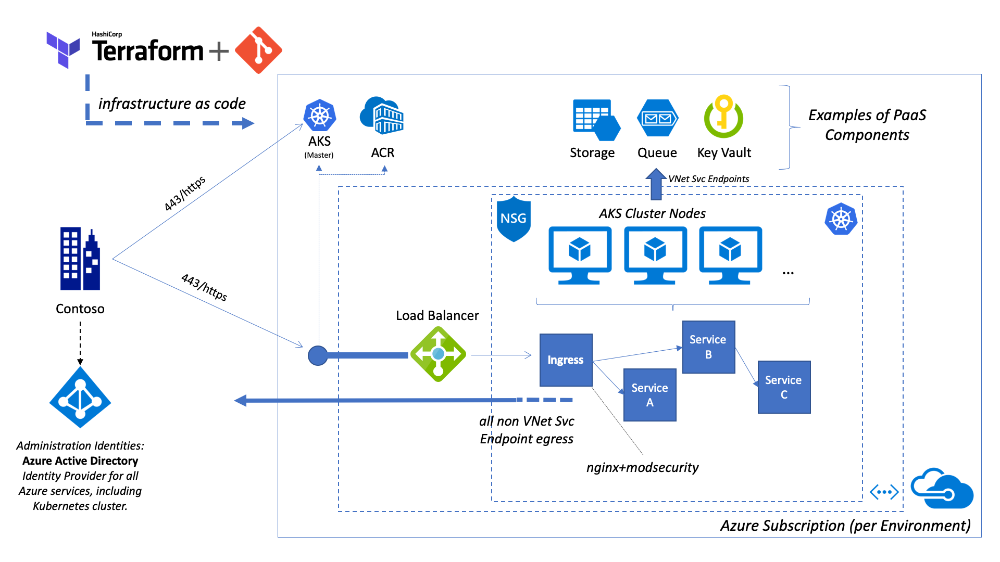

# End-to-End Azure Kubernetes Service (AKS) Deployment using Terraform

This is an end-to-end sample on how to deploy the [Azure Kubernetes Service (AKS)](https://azure.microsoft.com/en-us/services/kubernetes-service/) using [Terraform](https://www.terraform.io/).

## Overview

This diagram provides a rough overview of the deployed infrastructure when an optional Azure Firewall is deployed:


This diagram visualizes the deployed infrastructure with an External Load Balancer (no Azure Firewall):


Please note that the additional services like Azure Key Vault and Azure Storage depicted here and just example on PaaS components that can be integrated into the solution.

## Getting Started

TODO: Update.


## Deployment Structure

The deployment structure is basically divided into two parts. The first part takes care of the Azure Resources, the second part takes care of the in-cluster Kubernetes components.

- `01-aks`

- `02-aks-post-deploy`

    After completing the Azure resource deployment, the post deploy step configures the Kubernetes cluster role bindings and prepares the helm service account.

    > Requires cluster-admin rights on Kubernetes.

## Misc

### Getting AKS Admin credentials

```sh
az aks get-credentials --resource-group <TODO> --name <TODO> --admin --overwrite-existing
```

### Getting AKS User credentials

```sh
az aks get-credentials --resource-group <TODO> --name <TODO> --overwrite-existing
```

### Useful Links

- [Quick-Start Cert Manager with NGINX Ingress](http://docs.cert-manager.io/en/latest/tutorials/acme/quick-start/index.html)

## Acknowledgements

Big thanks to [Darius Tehrani](https://github.com/dariustehrani/) for lots of feedback and input!
